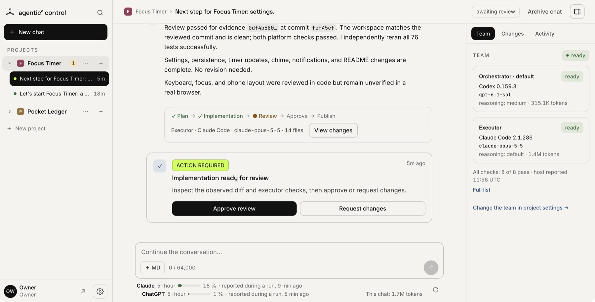
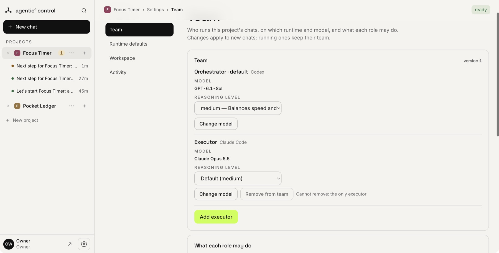
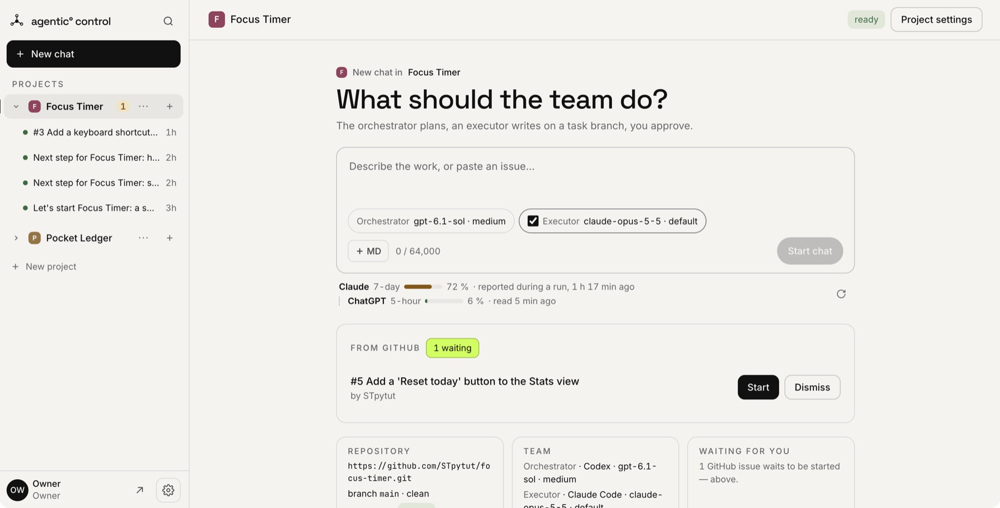
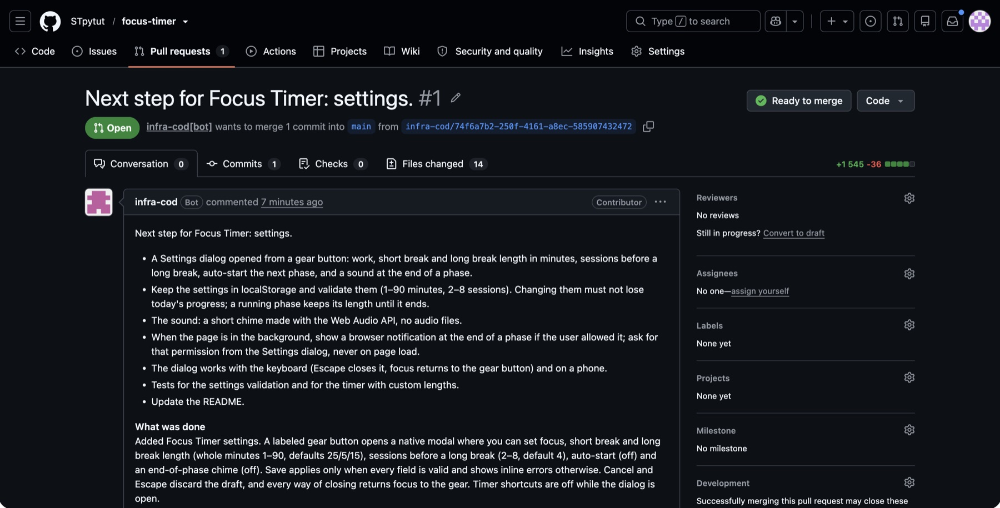

# Agentic Control

**A self-hosted control plane for AI coding agents. One agent plans and reviews,
another writes the code, and you approve before anything reaches your
repository.**

It runs on one Linux server you own, drives the agent CLIs you already pay for
(Codex, Claude Code, OpenCode) and gives you a web panel you can use from a
laptop or a phone.



## How a task goes

1. **You describe the task**, or label a GitHub issue.
2. **The orchestrator plans it.** For example, Codex reads the repository and
   writes a plan with acceptance criteria.
3. **An executor implements it** on a task branch. For example, Claude Code works
   in a persistent workspace on your server.
4. **The orchestrator reviews the result.** It checks the actual commit and runs
   the project's tests. If something is wrong, it sends the work back.
5. **You approve**, and the platform opens a pull request. If the task came from
   an issue, the pull request says `Closes #N`.

Neither agent grades its own work. Every step is recorded with the commit,
diff and checks it refers to, so you review evidence instead of a summary.

| Pick the team | Work arrives from GitHub | The result is a pull request |
| --- | --- | --- |
|  |  |  |

A worked example is [Focus Timer](https://github.com/STpytut/focus-timer). The
agents built the whole app through this panel, and every change came in as a
reviewed pull request, including issues #3, #5 and #7.

## What you get

- **Agent teams per project.** Any supported runtime can be the orchestrator or
  the executor, with a choice of models.
- **GitHub issue intake.** Issues are offered only from the repository's owner,
  members or collaborators, and only when they carry your label. Nothing starts
  until you press Start.
- **Review with evidence.** Each review is tied to an exact commit and the
  executor's checks, so a revision request names what has to change.
- **Pull requests from a GitHub App**, using short-lived installation tokens.
- **Operations built in:**
  - signed releases;
  - `infra-cod update` with automatic rollback;
  - encrypted backups with a restore drill before every update;
  - `infra-cod doctor`;
  - staged runtime upgrades (`qualify → promote → probation`).

## What it is not

- **Not a new agent.** The platform does not run its own agent loop or manage
  the agents' context. It orchestrates the native CLIs.
- **Not a hosted service.** Your code, workspaces and credentials stay on your
  server.
- **Not multi-tenant yet.** Version 1 has one owner per installation.

## Requirements

- Ubuntu 24.04 on x86-64, with root access, at least 2 GB RAM, 10 GB free disk
  and ports 80, 443 and 3100 free.
- A domain whose A record points at the server before installation. Caddy needs
  it to obtain a TLS certificate.
- Your own accounts for the agents you want to use. For example, a ChatGPT plan
  for Codex, a Claude plan for Claude Code, or a model provider of your choice
  for OpenCode.

## Install

The scripts and the public key come from this repository at a release tag. The
artifact comes from that tag's GitHub release. Every artifact is verified in
this order before anything is unpacked: the minisign signature, the checksum,
then the archive's member list.

```bash
git clone --depth 1 --branch <tag> https://github.com/STpytut/agentic-control.git
cd agentic-control
gh release download <tag> --dir /tmp/rel

# Checks the host and changes nothing
sudo ./deploy/install.sh --check --domain panel.example.com --acme-email you@example.com

sudo ./deploy/install.sh \
  --artifact /tmp/rel/infra-cod-<version>-linux-x64.tar.gz \
  --checksums /tmp/rel/SHA256SUMS \
  --signature /tmp/rel/SHA256SUMS.minisig \
  --public-key release/keys/infra-cod-release.pub \
  --domain panel.example.com \
  --acme-email you@example.com
```

The installer is idempotent. It sets up PostgreSQL, Caddy, the pinned Node,
systemd units and a separate OS user for each agent runtime. The owner's first
password is in `/etc/infra-cod/initial-credentials`.

Then install and sign in the agent runtimes you want:

```bash
sudo infra-cod runtime install codex --version <exact>
sudo infra-cod runtime login codex
sudo infra-cod runtime list
sudo infra-cod doctor
```

Updating later takes one command, and a failed update rolls back:

```bash
sudo infra-cod update --artifact … --checksums … --signature … \
  --public-key release/keys/infra-cod-release.pub
```

## Security model, in short

- **Caddy is the only listener exposed to the network.** The panel listens on
  loopback.
- **PostgreSQL is reached over a Unix socket with peer authentication.** There
  is no database password anywhere.
- **Agents run as their own OS users**, with no access to the database or to
  each other's credentials. Read-only steps run under a Landlock ruleset.
- **Issue text is fenced.** The agent receives it as a request to weigh, not as
  instructions.

You remain responsible for complying with the terms of the AI services whose
accounts you connect.

Details are in [docs/SECURITY.md](docs/SECURITY.md) and
[docs/OPERATIONS.md](docs/OPERATIONS.md). To report a vulnerability, see
[SECURITY.md](SECURITY.md).

## Status

The project is pre-1.0 (`0.4.0-rc`). It is developed and used every day by one
person on one server, and it has had more than a hundred release candidates.

Expect rough edges in onboarding. Most design documents are in Russian; the
developer overview is [docs/DEVELOPMENT.md](docs/DEVELOPMENT.md).

Website and early-access form: <https://agentic-control.pages.dev>.

## License

[GNU AGPL-3.0](LICENSE).

- You can use, change and self-host the platform freely.
- If you offer a modified version to others over a network, you must publish
  your changes under the same license.

Contributions are accepted under the [Contributor License Agreement](CLA.md);
see [CONTRIBUTING.md](CONTRIBUTING.md). For a commercial license without AGPL
obligations, open an issue or contact the maintainer.
