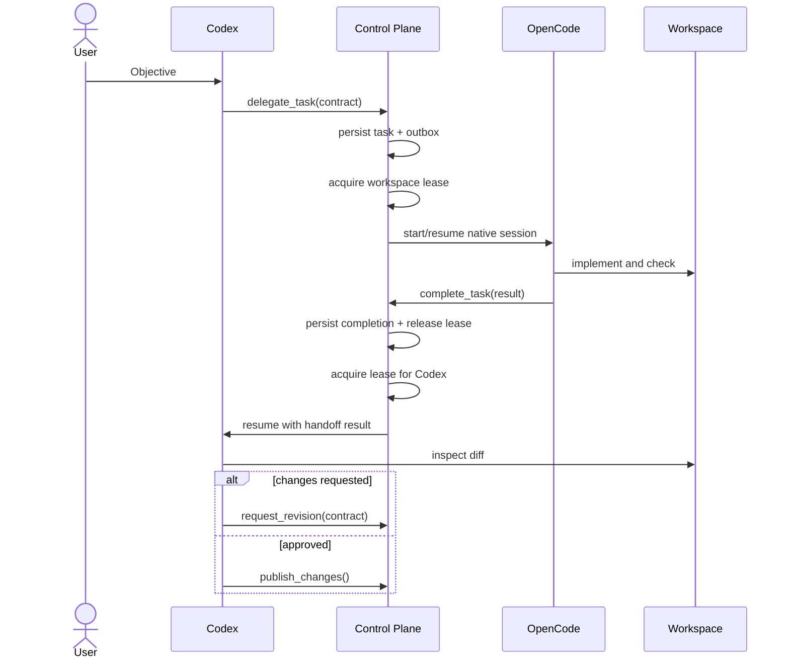

# Architecture

## 1. Архитектурные принципы

1. Native-first: агент запускается через официальный runtime/API/server interface.
2. Control plane, not harness: платформа управляет процессами и состоянием, но не мышлением агента.
3. Single writer: в V1 один project workspace имеет одного владельца записи.
4. Durable workflow: значимое изменение состояния фиксируется до выполнения следующего side effect.
5. Event-driven handoff: переходы между агентами выполняются структурированными командами и событиями.
6. Least privilege: worker не получает publishing и production credentials.
7. Provider independence: Agent, Runtime, Provider и Model — разные сущности.
8. Observable recovery: после сбоя система либо восстанавливает workflow, либо явно переводит его в `needs_attention`.

## 2. Контекст системы

Развёртывание self-hosted: один хост, на котором живут и панель, и база, и
workers. Внешней managed-платформы и внешней базы в контуре нет. Схема доступа:

```text
browser/phone ──HTTPS──▶ Caddy ──▶ 127.0.0.1:3100 Next standalone
                                        │
                          Unix socket PostgreSQL 17/main
                          (peer authentication)
                                        ▲
             workers ───────────────────┘  (свои peer-роли)
             runtime users агентов ───── X  (нет DB-доступа)
```

Полная матрица OS user → PG role, требования к `pg_ident.conf` и контракт с
Этапом 2 — [`deploy/systemd/README.md`](../deploy/systemd/README.md).

```text
MacBook / Mobile browser
                 │
                 ▼
        Web API + Realtime Gateway
                 │
                 ▼
┌──────────────────────────────────────┐
│            Control Plane             │
│ Projects / Tasks / Runs / Events     │
│ Session & Handoff Manager            │
│ Workspace Lock Manager               │
│ Approval / Policy Engine             │
│ Reconciler / Scheduler               │
└───────────────┬──────────────────────┘
                │
        Runtime Adapter Boundary
                │
      ┌─────────┼──────────┐
      ▼         ▼          ▼
   Codex     OpenCode  Antigravity
   native     native      native
   session    session     session
      └─────────┼──────────┘
                ▼
        Project filesystem + Git
```

## 3. Компоненты

### 3.1. Web Application

- project/task/run views;
- live event stream;
- пользовательский ввод;
- diff, checks и approvals;
- mobile responsive UI.

UI не является источником истины. После reconnect он восстанавливает состояние из API/event log.

### 3.2. Control Plane API

- CRUD projects и tasks;
- команды workflow;
- read models для UI;
- authorization и validation;
- выдача resumable stream cursor.

### 3.3. Session & Handoff Manager

Отвечает только за:

- связь `project ↔ agent ↔ native_session_id`;
- создание и resume native session;
- передачу task contract;
- передачу result summary;
- восстановление workflow;
- сохранение доступной usage telemetry.

Не отвечает за prompt assembly, compaction, cache keys, внутреннюю память и file retrieval runtime.

### 3.4. Runtime Supervisor

- запускает adapter workers;
- отслеживает PID/process handle;
- принимает нормализованные события;
- отправляет input/interrupt;
- выполняет graceful shutdown;
- сообщает reconciler о потерянных процессах.

Supervisor является единственным root-owned процессом runtime path. Control
plane обращается к нему через Unix socket с закрытым protocol allowlist и не
передаёт executable, OS user или workspace path. Supervisor самостоятельно
получает canonical project path и runtime profile из PostgreSQL, проверяет
runtime job lease и workspace fencing token, затем запускает фиксированный
adapter под отдельным Unix user с очищенным environment.

Codex app-server channel в текущем MVP разрешает только read-only threads.
Write-capable Codex channel потребует активный run/fence и отдельную policy
операцию; клиент не может повысить режим существующего channel.

Процесс runtime и доменная `AgentSession` не тождественны: процесс может завершиться, а native session оставаться resumable.

### 3.5. Workspace Manager

- создаёт и подключает project directories;
- проверяет допустимый canonical path;
- управляет repository metadata;
- предоставляет git status/diff;
- не помещает весь repository в LLM prompt.

### 3.6. Lock Manager

Обеспечивает single-writer invariant через durable lease с fencing token.

Lock содержит:

- `project_id`;
- `owner_run_id`;
- `lease_expires_at`;
- монотонный `fencing_token`;
- heartbeat timestamp;
- reason/status.

Adapter обязан перед началом write-capable run получить lock. Все команды, меняющие workspace через платформу, проверяют fencing token. Истёкший старый owner не может автоматически продолжить запись.

### 3.7. Event Store и Dispatcher

- атомарно сохраняет доменное состояние и outbox event;
- доставляет события обработчикам;
- ведёт attempts и dead-letter state;
- обеспечивает at-least-once delivery и idempotent consumers.

Dispatcher не выполняет privileged runtime side effects. Он атомарно
преобразует релевантный outbox event в уникальный durable `runtime_job` и
подтверждает исходное сообщение. Runtime Supervisor отдельно арендует job,
heartbeat-ит job и workspace lease и сохраняет native receipt. Это не позволяет
долгому agent run удерживать короткую outbox lease.

Пользовательский `chat.user_message` создаёт `codex_chat_turn`. Отдельный
непривилегированный chat worker арендует только этот тип job, открывает через
Supervisor read-only app-server channel и после завершённого turn одной
транзакцией сохраняет native session receipt, `chat.agent_message` и completed
job. Более поздний message того же task не может обогнать незавершённый ранний.

Kafka/Temporal не требуются для V1. Достаточно PostgreSQL outbox/job table; Redis/BullMQ добавляется только при измеримой необходимости.

### 3.8. Reconciler

Периодически сравнивает:

- записи active runs;
- реальные процессы;
- lock leases;
- native session availability;
- незавершённые outbox events.

Reconciler не угадывает успешность side effect. При неопределённости переводит объект в `needs_attention`.

## 4. Workspace model

Структура VPS:

```text
/srv/ai-control-plane/
├── projects/
│   ├── bear-app/
│   └── another-project/
├── runtime-state/
├── logs/
└── backups/
```

Project workspace содержит обычный repository. Служебные данные control plane хранятся вне repository, кроме явно версионируемых project instructions пользователя.

В V1:

- нет автоматических worktrees;
- нет параллельных writers;
- read-only наблюдение разрешено, если runtime это безопасно поддерживает;
- смена owner выполняется только после завершения/interrupt и подтверждённого освобождения lock.

## 5. Session model

### AgentSession

Долгоживущая ссылка на native session конкретного runtime.

```text
Project Bear
├── configured orchestrator task chat session
├── selected executor implementation session
└── optional executor implementation session
```

### AgentRun

Одна активность внутри session: запуск, resume с новым вводом или этап задачи.

Инварианты:

- session может иметь много последовательных runs;
- session ID хранится как opaque runtime-specific value;
- platform ID никогда не подставляется вместо native ID;
- потеря process handle не означает потерю session;
- новый run не создаётся автоматически, если предыдущий outcome неизвестен.

Разговор (Conversation) — линия задач: корневая задача и её последовательные
follow-up ([ADR-0014](adr/0014-conversation-task-session-run.md)). Сессия
принадлежит разговору: одна активная на `(conversation_id, role, agent_id)`, где
role — `chat` или `executor`. Follow-up продолжает ту же native session, ничего
не копируя; разные разговоры одного project не смешиваются. `purpose` —
только описание.

Native session ID уникален в своём namespace — `runtime_type` профиля, который
база выводит сама. Сессию другого runtime в том же разговоре не продолжают и не
перезаписывают: при первом ходе нового runtime она закрывается
(`closed_reason = runtime_changed`) и остаётся в истории.

ProjectAgentAssignment связывает project, role, Agent и RuntimeProfile. Task
фиксирует `orchestrator_assignment_id` и выбранные executor assignments.
`active_agent_id` означает текущего owner этапа и не используется для скрытой
смены orchestrator или его модели.

## 6. Handoff model

Handoff не переносит разговор одного агента другому. Он содержит минимальный контракт:

```yaml
task_id: BEAR-142
from_agent: codex
to_agent: opencode
objective: Implement workout achievement system
instructions: ...
constraints: []
acceptance_criteria: []
workspace_ref:
  project_id: bear-app
  git_head: abc123
relevant_paths: []
```

Результат worker:

```yaml
task_id: BEAR-142
run_id: run_...
status: completed
summary: Implemented achievement rules and tests
checks:
  - command: npm test
    status: passed
workspace_ref:
  git_head_before: abc123
  dirty: true
```

Codex обязан проверять фактический workspace и diff. Summary не является доказательством корректности.

## 7. Основной sequence



## 8. Streaming

Runtime adapter преобразует нативный поток в нормализованные envelopes, не удаляя доступный raw payload:

```json
{
  "event_id": "evt_...",
  "run_id": "run_...",
  "sequence": 42,
  "type": "runtime.output.delta",
  "occurred_at": "...",
  "payload": { "text": "..." },
  "raw_type": "runtime-specific-type"
}
```

Требования:

- порядок внутри одного run определяется `sequence`;
- reconnect использует last acknowledged cursor;
- UI выдерживает повторную доставку;
- большие raw outputs могут храниться отдельно с ссылкой из event;
- секреты редактируются до долговременного хранения.

## 9. Failure и recovery

### Control plane restart

1. API становится доступен.
2. Dispatcher продолжает незавершённый outbox.
3. Reconciler проверяет runs и processes.
4. Активные adapter processes переподключаются либо помечаются lost.
5. Native sessions сохраняются для resume.
6. Неопределённые side effects получают `needs_attention`.

### Runtime crash

- run получает `failed` или `lost` после reconciliation;
- lock не передаётся другому writer до expiry/подтверждённого завершения;
- resume выполняется только если runtime гарантирует семантику;
- автоматический retry допустим только для idempotent startup/input commands.

### Network disconnect UI

Run продолжается. Пользователь повторно подключается по cursor и получает пропущенные события.

## 10. Рекомендуемый стек

Стек является рекомендацией, не продуктовым инвариантом:

- frontend: Next.js/React, TypeScript;
- API/control plane: TypeScript service;
- database: PostgreSQL;
- realtime: WebSocket или SSE;
- job/outbox: PostgreSQL-first;
- runtime supervision: отдельные worker processes/containers;
- filesystem: persistent VPS volume;
- reverse proxy/TLS: Caddy или nginx;
- deployment: Docker Compose для V1.

Выбор фреймворка не должен предшествовать runtime PoC.

## 11. Будущие расширения

- parallel mode через explicit worktrees;
- несколько workers разных providers;
- scheduler и automations;
- multi-user roles;
- reusable workflow templates;
- richer diff/editor UI;
- provider cost-aware routing.

Эти расширения не должны ослаблять native-first и security boundaries.
